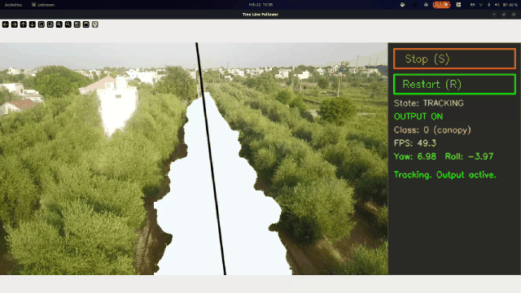

# Monocular Vision-Based UAV Navigation for Orchard Monitoring

YOLO segmentation + Kalman tracking for tree-canopy path following. Detects canopy segments, fits a center line, and outputs **yaw/roll** commands for drone navigation.

---

| UI During Live Deployment |
|-------------------------------------------------|
|  |

---

## Features

- **Segment detection** — YOLO-based instance segmentation of tree canopy / path
- **Interactive selection** — Click a segment to track; all classes shown until you choose one
- **IoU-based tracking** — Matches the same segment across frames (configurable threshold)
- **Center-line fit** — Morphology + line fit for stable yaw/roll control
- **Stop / Restart** — Pause output and raw feed; restart to show all segments again and reselect
- **Jetson-ready** — Optional env and setup for Jetson 5 (Orin / JetPack 6)

---

## Quick Start

```bash
# Clone and enter project
cd "Tree Line Follower"

# Install
pip install -r requirements.txt

# Run with video (no UI)
python scripts/run_inference.py --video "path/to/video.mp4"

# Run with interactive UI (recommended)
python scripts/run_inference.py --ui --video 0
```

**UI:** Video or camera is always shown. When segments appear, **click one** to start tracking and control output. Use **Stop (S)** to pause (raw feed only), **Restart (R)** to clear selection and choose another segment, **Q** to quit.

---

## Installation

**Requirements:** Python 3.8+, GPU with CUDA (for YOLO). Optional: Roboflow key for training.

```bash
pip install -r requirements.txt
```

Place a trained segmentation model at `checkpoints/canopy11s640.pt`, or train with:

```bash
python scripts/train.py --data datasets/Instance-4/data.yaml --epochs 100
```

### Jetson 5 (Orin / JetPack 6)

```bash
conda env create -f environment-jetson5.yml
conda activate tree-line-follower-jetson5
bash scripts/setup_jetson5_env.sh
```

---

## Usage

| Command | Description |
|--------|-------------|
| `python scripts/run_inference.py` | Default video pipeline (no UI) |
| `python scripts/run_inference.py --ui` | Interactive UI, default video |
| `python scripts/run_inference.py --ui --video 0` | Camera feed + UI |
| `python scripts/run_inference.py --ui --video path/to/video.mp4 --class-id 1` | Video + class filter (when no segment selected, all classes are shown) |

Config: `src/config.py` — e.g. `TRACK_IOU_THRESHOLD`, `IMG_WIDTH`, `IMG_HEIGHT`, model path.

---

## Project Layout

```
├── src/
│   ├── config.py          # Paths, IMG size, TRACK_IOU_THRESHOLD
│   ├── inference.py       # run_yolo, run_yolo_ui (YOLO + NMS + tracking + control)
│   ├── tracking.py        # Kalman + IoU-based track_bbox
│   ├── control.py         # control_drone (yaw/roll)
│   └── post_processing.py # NMS, morphology, center-line fit
├── scripts/
│   ├── run_inference.py    # Entry point (--ui, --video, --class-id)
│   ├── train.py           # Train YOLO segment model
│   ├── export_tensorrt.py # .pt → TensorRT
│   └── setup_jetson5_env.sh
├── checkpoints/            # Model weights (.pt)
├── datasets/               # Training data / video
├── requirements.txt
└── environment-jetson5.yml
```

---

## Intellectual property review

**Authors:** Kaushal Kishore, Ritabrata Chakraborty  

This project is patented. Use is not applicable; modification and distribution may be subject to applicable intellectual property rights. Acknowledgment of the authors is appreciated.

---

## License

See [Intellectual property review](#intellectual-property-review) above. Use and modification may be subject to applicable IP rights.
